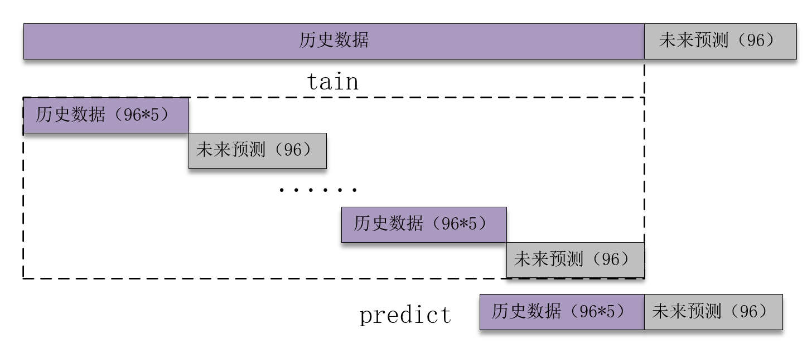

# 光伏功率预测（以LSTM为例）
## 导入数据
```
data_raw = pd.read_excel('Australia.xlsx')
```
(说明：对于csv文件,data_raw = pd.read_csv('123.csv'))

## 设置模型的特征数
```
timesteps = 48*7  #构造x，为72个数据,表示每次用前72个数据作为一段
predict_steps = 6 #构造y，为12个数据，表示用后12个数据作为一段
length = 48       #预测多步，预测96个数据，每次预测96个
feature_num = 6   #特征个数
```
## 函数调用说明

>训练过程
```
def create_dataset(datasetx, datasety=None, timesteps=96*7, predict_size=12)
```
构造数据集，用于真正预测未来数据,
整体的思路也就是，前面通过前timesteps个数据训练后面的predict_steps个未来数据
预测时取出前timesteps个数据预测未来的predict_steps个未来数据。
```
def data_scaler(datax, datay=None, timesteps=36, predict_steps=6)
```
数据的归一化
```
def LSTM_model_train(trainx, trainy, valx, valy, timesteps, predict_steps)
```
用于训练模型的函数， trainx trainy为训练数据集， valx valy为验证数据集， time_steps，predict_steps 与前面的含义相同。

```
>> 修改Epoch 
109  model.fit(trainx, trainy, epochs=10, batch_size=64)
model, loss_history, running_time = LSTM_model_train(train_x, train_y, test_x, test_y, timesteps, predict_steps)
```
可以修改epoch和batch_size。
```
model, loss_history, running_time = LSTM_model_train(train_x, train_y, test_x, test_y, timesteps, predict_steps)
```
模型的训练，记录模型参数，历史计算误差和运行时间
```
model.save('lstm_model.h5')
```
保存模型的结构和参数

> 预测过程
```
def predict_using_LSTM(model, data, timesteps, predict_steps, feature_num, length, scaler)
```
滚动predict, 因为每次只能预测6个数据，但是我要预测6个数据，所以采用的就是循环预测的思路。每次预测的6个数据，添加到数据集中充当预测x，然后在预测新的6个y，再添加到预测x列表中，如此往复,最终预测出48个点。
```
def error_and_plot(y_true, y_predict)
```
预测并计算误差和可视化

BiLSTM和GRU方法的函数类似。

## 代码思路



## 使用方法
```
pip install -r requirements.txt #安装依赖包
python LSTM.py
# python BiLSTM.py
# python GRU.py
```

## 项目地址
https://gitee.com/zjuermath/sun-forcast.git


